# Future Expansion & Feature Implementation Plan

This document outlines the architecture, purpose, integration, and implementation details of planned microservices. These services are currently decoupled from the active codebase to keep the project clean and simple, and can be introduced incrementally as scaling requirements grow.

---

## Architecture Registry of Future Services

### AUTH SERVICE

**Directory:** `auth-service/` (Removed, reference this plan for implementation)

# Auth Service

## Overview
- **Purpose:** Manages user authentication, token signatures, and API authorizations (Proposed).
- **Port:** `8081`
- **DDD Aggregate:** `AuthAggregate`
- **Dependencies:** `auth_db` / `user_db`
- **Technology Stack:** Spring Boot, Spring Security, JWT.

## Package Structure (Proposed)
```text
com.jobautomation.auth
├── controller
│   └── AuthController.java
├── config
│   └── SecurityConfig.java
├── service
│   └── TokenService.java
└── filter
    └── JwtTokenFilter.java
```

## APIs
| Endpoint | Method | Description |
| :--- | :--- | :--- |
| `/auth/login` | `POST` | Validates credentials and returns JWT. |
| `/auth/validate` | `GET` | Validates a JWT token. |

## Database Tables
- Shares read access with `user_db` or uses a replica.

## Request Flow
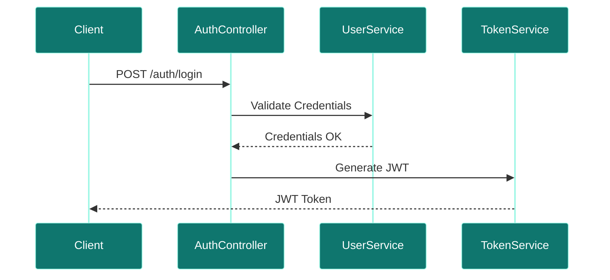

## Service Architecture Diagram
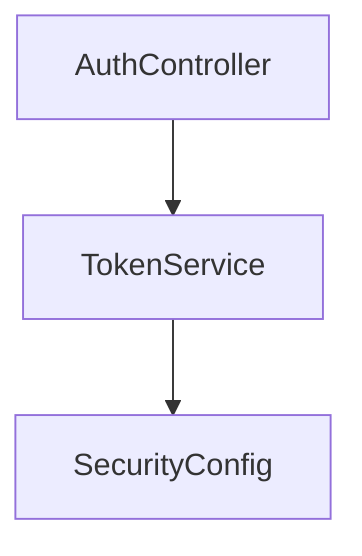

## Dependencies
- **Inbound:** API Gateway.
- **Outbound:** `user-service`.

## Schedulers
- *None.*

## Security
- Signs and validates JWT tokens using custom keys.

## Caching
- Proposed Redis cache for blacklisted tokens.

## Exception Handling
- Returns standard HTTP 401 and 403 authorization error codes.

## Monitoring
- Custom token metrics.

## Docker
- Standard Java 17 container.

## Kubernetes
- Capped CPU and Memory deployments.

## CI/CD
- Deployed via Jenkins/GitHub Actions pipeline stages.

## Key Takeaways
- Proposed to decouple IAM rules from business services.
- Gateway delegates validation to Auth Service.

---

### RESUME SERVICE

**Directory:** `resume-service/` (Removed, reference this plan for implementation)

# Resume Service

## Overview
- **Purpose:** Manages resume storage, document formatting, and text extraction pipelines.
- **Port:** `8082` (Logically separate context inside `user-service`).
- **DDD Aggregate:** `UserAggregate`
- **Dependencies:** `user_db` (MySQL)
- **Technology Stack:** Spring Boot, Spring Data JPA, Apache Tika.

## Package Structure
```text
com.jobautomation.user
├── controller
│   └── ResumeController.java
├── entity
│   └── ResumeEntity.java
├── repository
│   └── ResumeRepository.java
└── service
    ├── ResumeService.java
    └── impl
        └── ResumeServiceImpl.java
```

## APIs
| Endpoint | Method | Description |
| :--- | :--- | :--- |
| `/resume/update-resume` | `POST` | Uploads a user resume file. |
| `/resume/users/{userId}/resume` | `GET` | Fetch resume text content. |

## Database Tables
| Table | Purpose | Relationships |
| :--- | :--- | :--- |
| `resumes` | Stores parsed text extracted from resumes. | Many-To-One with `users`. |

### ER Diagram


## Internal Components
- **ResumeController:** Endpoint handler for uploads.
- **ResumeServiceImpl:** Handles multipart parsing and storage.

## Request Flow
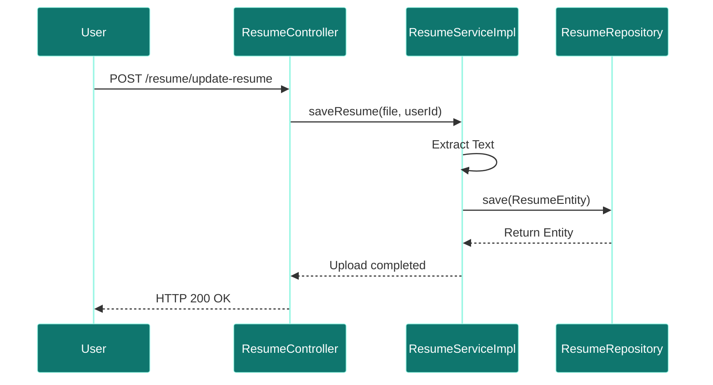

## Service Architecture Diagram
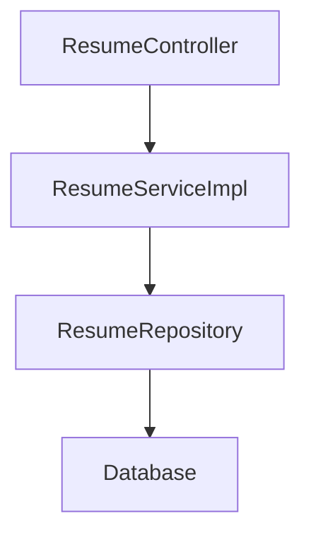

## Dependencies
- **Inbound:** `ai-recommendation-service`, API Gateway.
- **Outbound:** `user_db` (MySQL).

## Schedulers
- *None.*

## Security
- Requires user credentials.

## Caching
- No caching.

## Exception Handling
- Handles parsing and validation exceptions.

## Monitoring
- Actuator endpoint.

## Docker
- Uses same container as `user-service`.

## Kubernetes
- Part of user-service deployment block.

## CI/CD
- Deployed via Jenkins/GitHub Actions pipeline stages.

## Key Takeaways
- Separates resume file handling from basic profile properties.
- Extracted text is stored in MySQL for AI matching.

---

### SCHEDULER SERVICE

**Directory:** `scheduler-service/` (Removed, reference this plan for implementation)

# Scheduler Service

## Overview
- **Purpose:** Manages scheduled triggers for scraping runs and notification dispatches (Proposed).
- **Port:** `8087`
- **Dependencies:** Quartz Scheduler.
- **Technology Stack:** Spring Boot, Spring Quartz.

## Package Structure (Proposed)
```text
com.jobautomation.scheduler
├── controller
│   └── ScheduleController.java
├── config
│   └── QuartzConfig.java
├── job
│   └── ScraperTriggerJob.java
└── service
    └── ScheduleService.java
```

## APIs
| Endpoint | Method | Description |
| :--- | :--- | :--- |
| `/scheduler/create` | `POST` | Creates a new cron scraping schedule. |
| `/scheduler/cancel/{id}` | `POST` | Cancels an active schedule. |

## Database Tables
- Uses Quartz JDBC tables to store schedule metadata.

## Request Flow
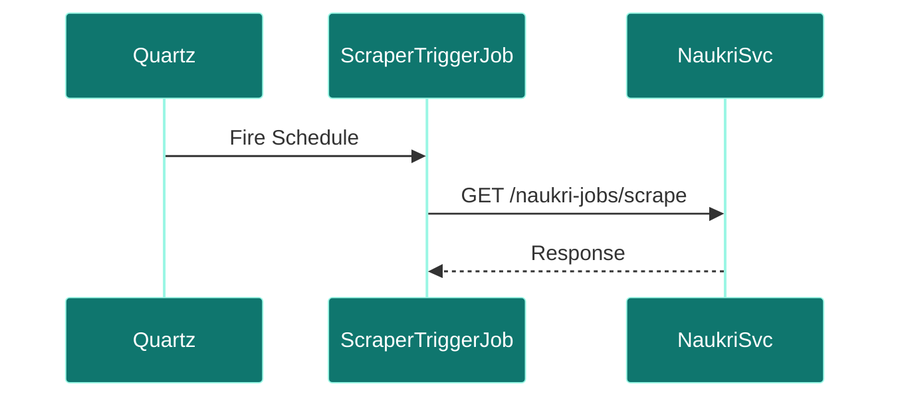

## Service Architecture Diagram
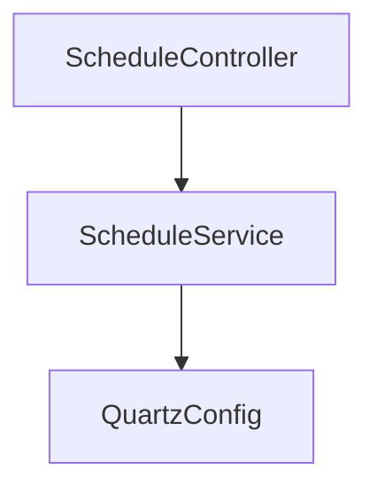

## Dependencies
- **Inbound:** Admin Panel.
- **Outbound:** `linkedin-service`, `naukri-service`.

## Schedulers
- Runs custom quartz triggers defined by candidate cron settings.

## Security
- Admin security checks.

## Caching
- No caching.

## Exception Handling
- Handles Quartz exceptions and missed trigger events.

## Monitoring
- Custom alert triggers.

## Docker
- standard Alpine runtime.

## Kubernetes
- Deployed alongside core components.

## CI/CD
- Deployed via Jenkins/GitHub Actions pipeline stages.

## Key Takeaways
- Decouples cron setups from scraper containers.
- Proposed to support daily scraping loops.

---

### EMAIL SERVICE

**Directory:** `email-service/` (Removed, reference this plan for implementation)

# Email Service

## Overview
- **Purpose:** Dedicated transactional and digest email dispatch system (Proposed).
- **Port:** `8089`
- **Dependencies:** SMTP Mail Server.
- **Technology Stack:** Spring Boot, JavaMailSender.

## Package Structure (Proposed)
```text
com.jobautomation.email
├── service
│   └── EmailServiceImpl.java
└── config
    └── MailConfig.java
```

## APIs
- Uses a Kafka consumer to process email requests asynchronously.

## Request Flow
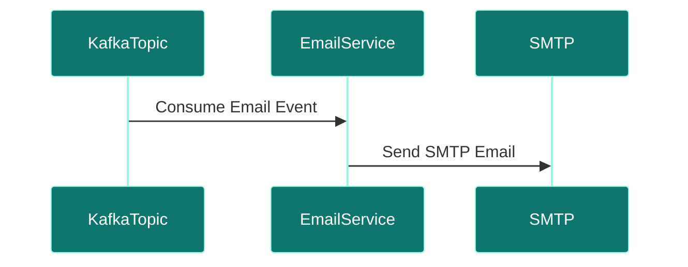

## Service Architecture Diagram
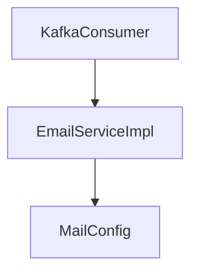

## Dependencies
- **Inbound:** Kafka Broker.
- **Outbound:** Mail Server.

## Schedulers
- *None.*

## Security
- Secured with SMTP TLS configurations.

## Caching
- No caching.

## Exception Handling
- Retries on transient SMTP connect errors.

## Monitoring
- Logs successful and failed mail deliveries.

## Docker
- standard Alpine runtime.

## Kubernetes
- standard deployment.

## CI/CD
- Deployed via Jenkins/GitHub Actions pipeline stages.

## Key Takeaways
- Decouples email sending from web threads.
- Subscribes to notification topics.

---

### NOTIFICATION SERVICE

**Directory:** `notification-service/` (Removed, reference this plan for implementation)

# Notification Service

## Overview
- **Purpose:** Manages candidate alert distribution channels like SMS and Push notifications (Proposed).
- **Port:** `8088`
- **Dependencies:** `notification_db`.
- **Technology Stack:** Spring Boot, Firebase, Twilio.

## Package Structure (Proposed)
```text
com.jobautomation.notification
├── controller
│   └── NotificationController.java
├── service
│   └── PushService.java
└── repository
    └── NotificationRepository.java
```

## APIs
| Endpoint | Method | Description |
| :--- | :--- | :--- |
| `/notifications/send` | `POST` | Publishes notification event. |

## Request Flow
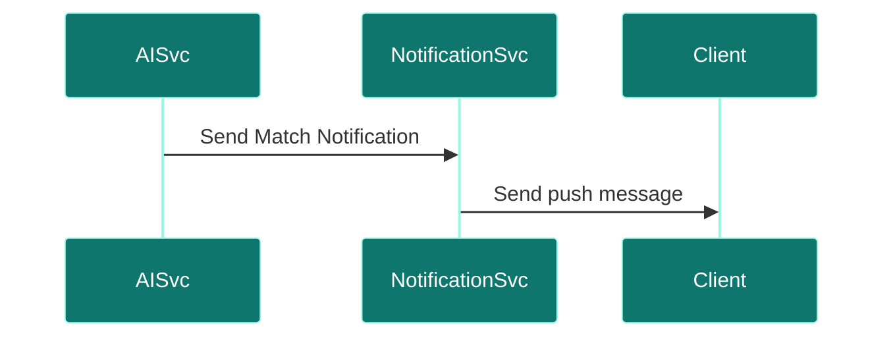

## Service Architecture Diagram
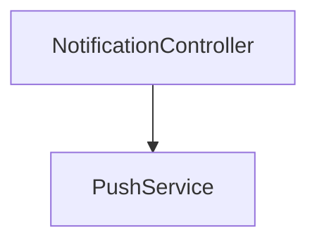

## Dependencies
- **Inbound:** `ai-recommendation-service`.
- **Outbound:** Firebase / Twilio APIs.

## Schedulers
- *None.*

## Security
- Private API authentication keys.

## Caching
- No caching.

## Exception Handling
- SMS/Push delivery failures are logged and retried.

## Monitoring
- Custom metrics logs.

## Docker
- standard Alpine image.

## Kubernetes
- standard configurations.

## CI/CD
- Deployed via Jenkins/GitHub Actions pipeline stages.

## Key Takeaways
- Proposed to inform users about newly matched postings.

---

### FILE SERVICE

**Directory:** `file-service/` (Removed, reference this plan for implementation)

# File Service

## Overview
- **Purpose:** Dedicated binary storage service for resumes and logs (Proposed).
- **Port:** `8090`
- **Dependencies:** AWS S3 / Local storage.
- **Technology Stack:** Spring Boot, AWS SDK.

## Package Structure (Proposed)
```text
com.jobautomation.file
├── controller
│   └── FileController.java
└── service
    └── StorageService.java
```

## APIs
| Endpoint | Method | Description |
| :--- | :--- | :--- |
| `/files/upload` | `POST` | Uploads a binary file. |
| `/files/download/{id}` | `GET` | Fetches a binary file. |

## Request Flow
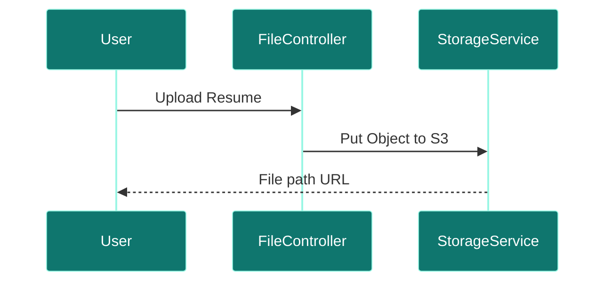

## Service Architecture Diagram
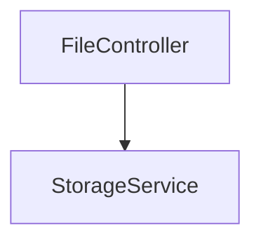

## Dependencies
- **Inbound:** API Gateway.
- **Outbound:** AWS S3 or shared volumes.

## Schedulers
- *None.*

## Security
- Requires valid user access token.

## Caching
- Proposed Redis cache for frequent files.

## Exception Handling
- Catches file size and storage access exceptions.

## Monitoring
- Storage volume checks.

## Docker
- standard Alpine runtime.

## Kubernetes
- Deployed with volume mounts.

## CI/CD
- Deployed via Jenkins/GitHub Actions pipeline stages.

## Key Takeaways
- Decouples file uploads from user transactions.

---

### SEARCH SERVICE

**Directory:** `search-service/` (Removed, reference this plan for implementation)

# Search Service

## Overview
- **Purpose:** Full-text indexing and fuzzy search on job descriptions (Proposed).
- **Port:** `8091`
- **Dependencies:** Elasticsearch.
- **Technology Stack:** Spring Boot, Spring Data Elasticsearch.

## Package Structure (Proposed)
```text
com.jobautomation.search
├── controller
│   └── SearchController.java
└── service
    └── IndexService.java
```

## APIs
| Endpoint | Method | Description |
| :--- | :--- | :--- |
| `/search/jobs` | `GET` | Queries index for keyword matches. |

## Request Flow
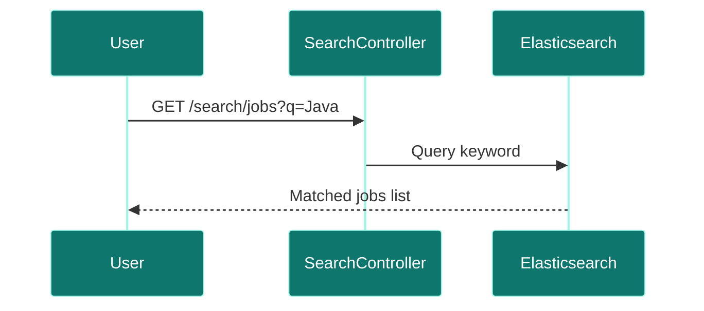

## Service Architecture Diagram
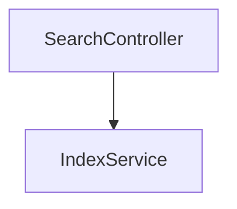

## Dependencies
- **Inbound:** API Gateway.
- **Outbound:** Elasticsearch.

## Schedulers
- Proposed nightly synchronization schedule.

## Security
- Basic authentication keys.

## Caching
- Elasticsearch native queries.

## Exception Handling
- Catches query parsing exceptions.

## Monitoring
- Elasticsearch health checks.

## Docker
- standard Alpine runtime.

## Kubernetes
- standard deployments.

## CI/CD
- Deployed via Jenkins/GitHub Actions pipeline stages.

## Key Takeaways
- Designed to index thousands of job records for search query speeds.

---

### CONFIG SERVER

**Directory:** `config-server/` (Removed, reference this plan for implementation)

# Config Server

## Overview
- **Purpose:** Centralized, git-backed microservices configuration registry (Proposed).
- **Port:** `8888`
- **Dependencies:** GitHub Repository.
- **Technology Stack:** Spring Cloud Config Server.

## Package Structure (Proposed)
```text
com.jobautomation.configserver
└── ConfigServerApplication.java
```

## APIs
- Exposes property configurations to boot microservices.

## Request Flow
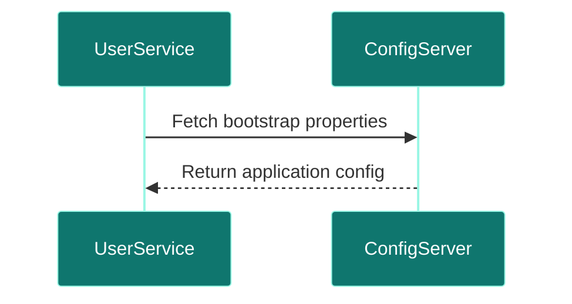

## Dependencies
- **Inbound:** Core services.
- **Outbound:** Git repository.

## Security
- Property decryption via symmetric keys.

## Docker
- Alpine build wrapper.

## Key Takeaways
- Enables dynamic property refresh without redeploying microservices.

---

### SERVICE REGISTRY

**Directory:** `service-registry/` (Removed, reference this plan for implementation)

# Service Registry

## Overview
- **Purpose:** Netflix Eureka registry for service registration and discovery (Proposed).
- **Port:** `8761`
- **Technology Stack:** Spring Cloud Netflix Eureka Server.

## Package Structure (Proposed)
```text
com.jobautomation.registry
└── ServiceRegistryApplication.java
```

## Request Flow
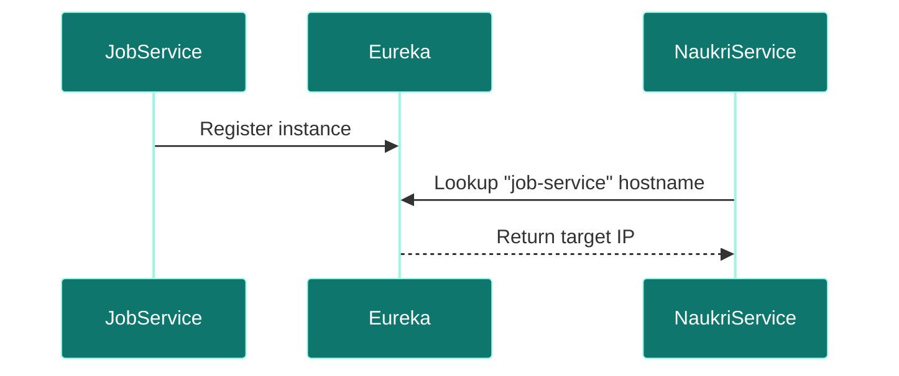

## Key Takeaways
- Eliminates hardcoded hostname settings inside scraper properties.

---

### MONITORING SERVICE

**Directory:** `monitoring-service/` (Removed, reference this plan for implementation)

# Monitoring Service

## Overview
- **Purpose:** Aggregates metrics, logs, and trace telemetry across services (Proposed).
- **Port:** `9090` (Prometheus) / `3000` (Grafana)
- **Technology Stack:** Prometheus, Grafana.

## Request Flow
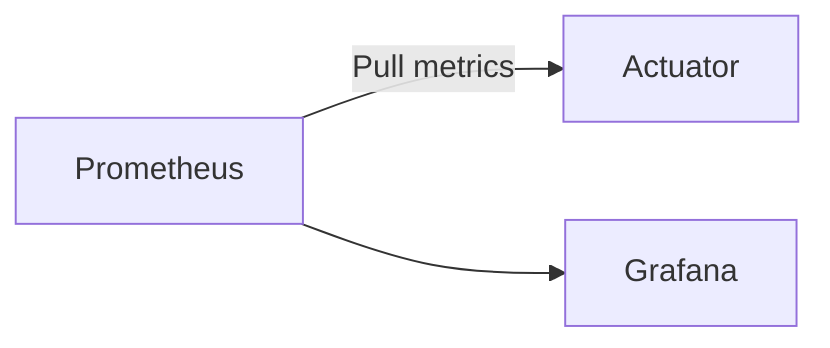

## Key Takeaways
- Visualizes heap dumps, CPU cycles, and database query latency.

---

### GATEWAY SERVICE

**Directory:** `gateway-service/` (Removed, reference this plan for implementation)

# Gateway Service

## Overview
- **Purpose:** API Gateway entrypoint routing downstream.
- **Port:** `8080`
- **Dependencies:** Core microservices network.
- **Technology Stack:** Spring Cloud Gateway, Netty.

## Package Structure
```text
com.jobautomation.gateway
└── ApiGatewayApplication.java
```

## Routing Rules
| Path Pattern | Forward Destination URL | Downstream Service |
| :--- | :--- | :--- |
| `/users/**` | `http://user-service:8082` | `user-service` |
| `/resume/**` | `http://user-service:8082` | `user-service` |
| `/add-jobs/**` | `http://job-service:8083` | `job-service` |
| `/apply-job/**` | `http://job-service:8083` | `job-service` |
| `/linkedin-jobs/**` | `http://linkedin-service:8084` | `linkedin-service` |
| `/naukri-jobs/**` | `http://naukri-service:8085` | `naukri-service` |
| `/aijobagent/**` | `http://ai-recommendation-service:8086` | `ai-recommendation-service` |

## Request Flow
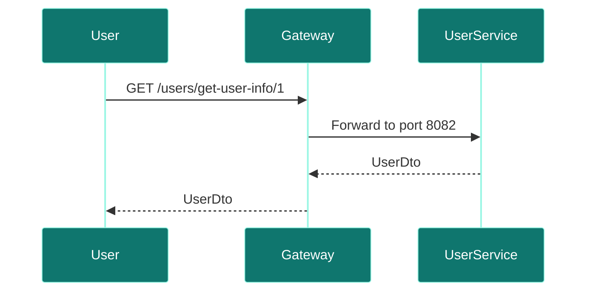

## Service Architecture Diagram
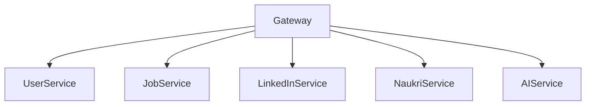

## Dependencies
- **Inbound:** User Browser.
- **Outbound:** Microservices.

## Schedulers
- *None.*

## Security
- Proposed location for central JWT verification.

## Caching
- Route cache mappings.

## Exception Handling
- Returns HTTP 503 if downstream services are offline.

## Monitoring
- Prometheus gateway connection metrics.

## Docker
- Exposed on port `8080`.

## Kubernetes
- Ingress mappings target gateway service.

## CI/CD
- Deployed via Jenkins/GitHub Actions pipeline stages.

## Key Takeaways
- Acts as the single entry point for routing client requests.

---