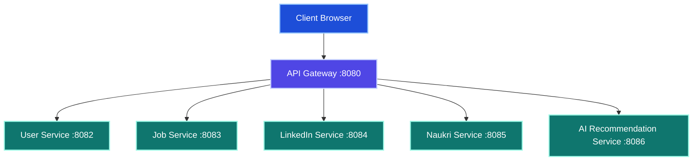
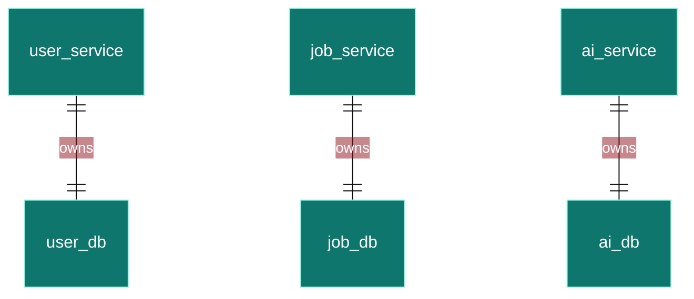
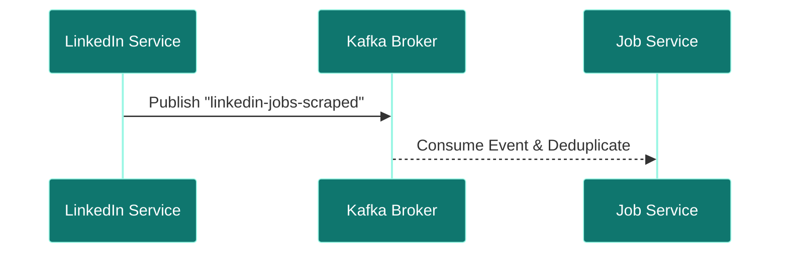
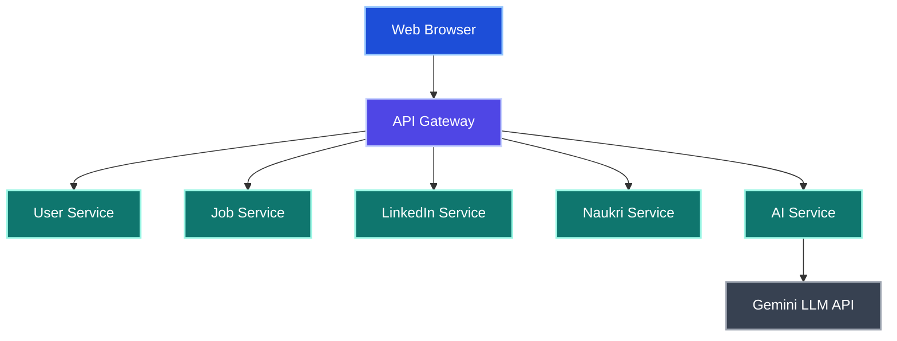
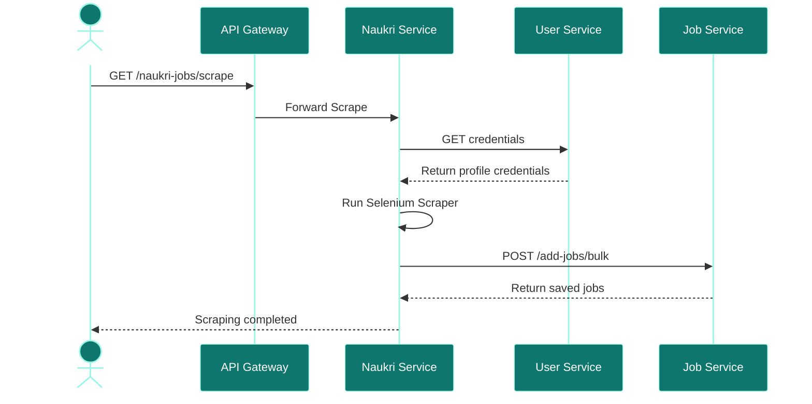

# careersync-ai-rest-orchestrator
A distributed Spring Boot 3 microservices platform that automates job discovery, scraping, and applications across LinkedIn and Naukri.com using Selenium ChromeDriver, integrated with Google Gemini AI   │ for smart resume analysis and matching.

# Job Automation Platform: Microservices Architecture Reference

## Executive Summary
The Job Automation Platform is an enterprise-grade solution designed to automate the lifecycle of job searches, personalized scraping, deduplication, resume analysis, and applications across major career sites (LinkedIn and Naukri). The system has transitioned from a monolithic architecture to a distributed, decoupled microservices model to resolve memory conflicts, isolate web browser automation failures, and allow individual services to scale based on their unique workloads.

## Existing Monolith
The legacy system ran on port `8080` and was compiled as a single Spring Boot application. All processes—user profiles, resume uploading, Selenium scrapers, database writes, and Gemini AI queries—lived in the same JVM. This caused heavy Selenium browser processes to trigger memory crashes that brought down unrelated features.

## Why Migration
Migrating to a microservices architecture solves key operational and structural problems:
1. **Resource Isolation:** Headless Chrome browser threads (consuming ~500MB+ each) are isolated to dedicated scraper nodes.
2. **Database Segregation:** Services own their database schemas, enforcing strict transaction and data access boundaries.
3. **Targeted Scaling:** Scraper instances scale horizontally on memory utilization, while core transactional services scale on CPU.
4. **Agility:** Different teams can deploy independent microservices without rebuilding or affecting other components.

## Target Architecture
The platform is organized into six core microservices and a shared library:
- **`api-gateway` (Port 8080):** Central entry point routing downstream traffic.
- **`user-service` (Port 8082):** Manages candidate profiles, credential storage, and resume details.
- **`job-service` (Port 8083):** Tracks and deduplicates scraped job listings and application status.
- **`linkedin-service` (Port 8084):** Drives Selenium bots to scrape and apply on LinkedIn.
- **`naukri-service` (Port 8085):** Drives Selenium bots to scrape keywords/recommended jobs on Naukri.
- **`ai-recommendation-service` (Port 8086):** Manages context construction and queries Google Gemini API.



## Service Boundaries
Service boundaries are defined strictly by business capabilities:
- **Identity & Profiles:** Owned by User Service.
- **Job Inventory:** Owned by Job Service.
- **Scraper Orchestration:** Split between LinkedIn and Naukri services.
- **AI Matching Logic:** Owned by AI Recommendation Service.

## Database Per Service
Each microservice is bound to its own database. Cross-service database queries are strictly prohibited; data queries must go through service APIs.
- **`user_db` (MySQL Port 3307):** Owned by User Service.
- **`job_db` (MySQL Port 3308):** Owned by Job Service.
- **`ai_db` (MySQL Port 3309):** Owned by AI Service.



## Event Driven Architecture
The target production roadmap replaces direct HTTP calls with an event-driven architecture using Kafka:
1. `linkedin-jobs-scraped`: Raw scraped LinkedIn postings published as events.
2. `naukri-jobs-scraped`: Raw scraped Naukri postings published as events.
3. `job-applications-triggered`: Published when a candidate clicks apply.



## Synchronous Communication
For transactional operations, services communicate synchronously via REST APIs using Spring `WebClient`. Max buffer limits are configured to 10MB to handle large bulk lists of job payloads.
```java
WebClient.builder()
    .codecs(configurer -> configurer.defaultCodecs().maxInMemorySize(10 * 1024 * 1024))
    .build();
```

## Async Communication
Proposed asynchronous pipelines will use Apache Kafka topic loops to handle scraping runs. This ensures scrapers do not crash during heavy database indexing.

## API Gateway
The `api-gateway` routes user requests to correct endpoints based on paths, abstracting internal microservice host configurations.
- `/users/**` and `/resume/**` route to `user-service`.
- `/add-jobs/**` and `/apply-job/**` route to `job-service`.
- `/linkedin-jobs/**` routes to `linkedin-service`.
- `/naukri-jobs/**` routes to `naukri-service`.
- `/aijobagent/**` routes to `ai-recommendation-service`.

## Config Server
Proposed Git-backed central config server to manage configurations and environment properties for all microservices in a single, dynamic repository.

## Eureka Discovery
Proposed Eureka service registry to allow dynamic scaling and automated target hostname lookup across services.

## Security Layer
The system uses BCrypt hashing for credentials and token security filters at the gateway level to restrict internal endpoint access.

## Caching Layer
Proposed Redis caching layers for duplicate URL checks and user sessions to reduce database read latencies.

## Monitoring Layer
Observability features include Spring Boot Actuator endpoints coupled to Prometheus servers, presenting custom latency, health, and throughput metrics in Grafana.

## Logging Layer
SLF4J/Logback logs are exported to files and standard output. Debug profiles are enabled for package `com.jobautomation` to capture scraper pipeline progress.

## Deployment Architecture
Services are containerized and deployed on bridge networks. Persistent volumes protect database files.
- `user-db-mysql` (3307)
- `job-db-mysql` (3308)
- `ai-db-mysql` (3309)

## Docker Architecture
Each service is containerized via custom `Dockerfile` using `eclipse-temurin:17-jre-alpine` runtime. Selenium scraper services include standard Chrome and web driver binaries.

## Kubernetes Architecture
Kubernetes manifests configure deployments, headless service mapping, persistent volume claims (PVCs), and horizontal pod auto-scalers (HPA) to scale scraper pods on memory utilization thresholds.

## High-Level Design


## Low-Level Design
Llow-level logic centers around the `JobDeduplicationService` inside `job-service`. Incoming JSON listings are parsed, checked against DB index caches, and either dropped or saved.

## Data Flow
1. Scraper bots gather job listing details.
2. Bots push job arrays to `job-service`.
3. `job-service` runs SQL deduplication and commits.
4. AI service requests profile details and resume content from `user-service`.
5. AI service formats prompts and posts to Gemini API.

## Sequence Diagrams


## Scaling Strategy
Scraper services require large memory footprints. They are scaled on memory thresholds (>80%) and concurrent scraper execution limits are capped using semaphores.

## Migration Strategy
The Strangler Fig Pattern is applied to extract services from the monolith step-by-step:
1. Extract shared elements into `common-library`.
2. Extract user database and deployment scripts.
3. Decouple Job entities and routes.
4. Separate Selenium scrapers and introduce Feign/REST communication.
5. Setup API Gateway and centralize requests.

## Risks
- **Selenium memory leakage:** Capped by strict Docker container memory limits.
- **Anti-bot detection:** Solved using rotating proxy nodes and randomized delay times.
- **Database desynchronization:** Addressed with idempotent transactional APIs.

## Trade-offs
- **Complexity:** Service communication introduces network overhead and serialization latency.
- **Deployment overhead:** Requires managing multiple databases and service runtimes.
- **Consistency:** Eventual consistency patterns replace monolithic immediate commits.

## Future Enhancements
- Integration of Spring Cloud Netflix Eureka.
- Transition to central Config Server.
- Asynchronous Kafka queues.
- Elasticsearch integrations for resume matching.

## Key Takeaways
- Decoupling scraping processes ensures user profile operations remain highly available.
- Individual databases isolate domain boundaries and block illegal cross-service calls.
- elevated buffer sizes for WebClient prevent packet deserialization errors.

# 🏗️ Job Automation Platform — Microservices Setup & Running Guide

Welcome to the newly decomposed **Job Automation Platform**. This multi-module Spring Boot application automates job searching, scraping, deduplication, and applying on LinkedIn and Naukri using Selenium, and provides AI-powered resume and career advice using Google Gemini.

---

## 🗺️ Microservice Architecture & Port Map

The monolith has been migrated into **6 microservices** and **1 shared library**:

| Service/Module | Port | Database | Primary Responsibility |
|---|---|---|---|
| 📦 `common-library` | *None (JAR)* | — | Shared DTOs, Exceptions (`InvalidUserException`), and Constants |
| 🔀 `api-gateway` | `8080` | — | Spring Cloud Gateway – routes external traffic to backend services |
| 👤 `user-service` | `8082` | `user_db` | Manages users, credentials, preferences, and resumes |
| 💼 `job-service` | `8083` | `job_db` | Job catalog, status tracking, and the job deduplication engine |
| 🔗 `linkedin-service` | `8084` | — | Stateless Selenium worker for LinkedIn login, scraping, and easy-apply |
| 📋 `naukri-service` | `8085` | — | Stateless Selenium worker for Naukri login, scraping, and search URL building |
| 🤖 `ai-recommendation-service` | `8086` | `ai_db` | Gemini LLM integration, prompt assembly, and response store |

---

## 🗄️ Database Setup

Ensure MySQL is running locally. The platform relies on three separate schemas:
1. `user_db`
2. `job_db`
3. `ai_db`

Spring Boot's `ddl-auto=update` is active across all services, so schemas and tables will be created automatically upon startup if they do not exist.

> [!NOTE]
> Database configurations can be modified in each service's `application.properties` under `src/main/resources/`. The default configuration assumes:
> - **URL:** `jdbc:mysql://localhost:3306/<db_name>`
> - **Username:** `root`
> - **Password:** `root`

---

## 🛠️ Build and Compilation

To compile the entire project, run the following Maven command from the root directory (`job-automation-platform/`):

```bash
mvn clean compile
```

To build and package the services into runnable JARs:

```bash
mvn clean package -DskipTests
```

---

## 🚀 Running the Services

### Prerequisites
1. **Google Gemini API Key**: The AI service requires a Gemini API key. Set it in your environment variables:
   - **Windows (PowerShell):** `$env:GEMINI_API_KEY="your_api_key"`
   - **Linux/macOS:** `export GEMINI_API_KEY="your_api_key"`
2. **ChromeDriver**: Ensure you have Chrome and ChromeDriver installed for the Selenium bots (`linkedin-service` and `naukri-service`).

### Startup Order
For local execution, run the services in the following order:

1. **User Service** (Port 8082)
   ```bash
   cd user-service
   mvn spring-boot:run
   ```
2. **Job Service** (Port 8083)
   ```bash
   cd job-service
   mvn spring-boot:run
   ```
3. **LinkedIn Service** (Port 8084)
   ```bash
   cd linkedin-service
   mvn spring-boot:run
   ```
4. **Naukri Service** (Port 8085)
   ```bash
   cd naukri-service
   mvn spring-boot:run
   ```
5. **AI Recommendation Service** (Port 8086)
   ```bash
   cd ai-recommendation-service
   mvn spring-boot:run
   ```
6. **API Gateway** (Port 8080)
   ```bash
   cd api-gateway
   mvn spring-boot:run
   ```

---

## 🔗 Inter-Service Communication Details

The services interact via synchronous REST calls using Spring's `WebClient`. Key paths are:
- `user-service` exposes `/users/by-email/{email}` to return decrypted login credentials.
- `job-service` exposes `/add-jobs/jobs/bulk` (a POST endpoint) for scrapers to publish newly crawled items.
- `ai-recommendation-service` reads user profiles from `user-service` (`/users/{id}`), resume documents from `user-service` (`/resume/users/{userId}/resume`), queries jobs and application statuses from `job-service` (`/add-jobs/jobs` and `/apply-job/jobs/applications`), and calls the Gemini API to construct recommendations.

---

## 📡 Gateway Routing Rules (`localhost:8080`)

External clients should call backend endpoints through the API Gateway at port `8080`. The Gateway routes requests as follows:

- **User operations:** `/users/**` and `/resume/**` → `user-service` (Port `8082`)
- **Job operations:** `/add-jobs/**` and `/apply-job/**` → `job-service` (Port `8083`)
- **LinkedIn operations:** `/linkedin-jobs/**` → `linkedin-service` (Port `8084`)
- **Naukri operations:** `/naukri-jobs/**` → `naukri-service` (Port `8085`)
- **AI Recommendation Engine:** `/aijobagent/**` → `ai-recommendation-service` (Port `8086`)
