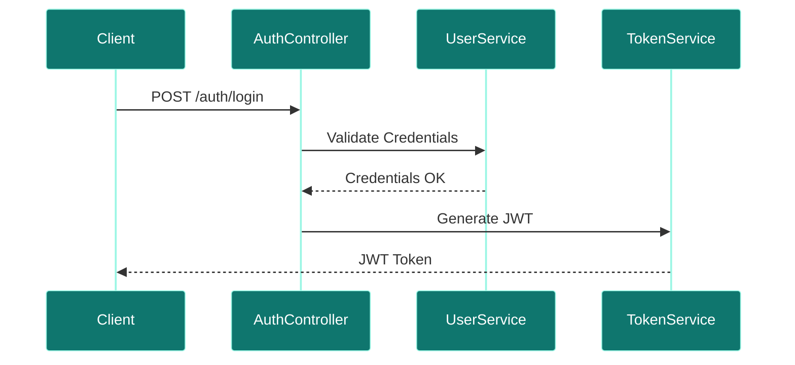
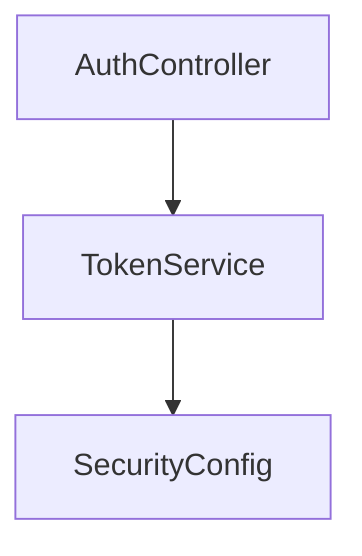

# Auth Service

## Overview
- **Purpose:** Manages user authentication, token signatures, and API authorizations (Proposed).
- **Port:** `8081`
- **DDD Aggregate:** `AuthAggregate`
- **Dependencies:** `auth_db` / `user_db`
- **Technology Stack:** Spring Boot, Spring Security, JWT.

## Package Structure (Proposed)
```text
com.jobautomation.auth
├── controller
│   └── AuthController.java
├── config
│   └── SecurityConfig.java
├── service
│   └── TokenService.java
└── filter
    └── JwtTokenFilter.java
```

## APIs
| Endpoint | Method | Description |
| :--- | :--- | :--- |
| `/auth/login` | `POST` | Validates credentials and returns JWT. |
| `/auth/validate` | `GET` | Validates a JWT token. |

## Database Tables
- Shares read access with `user_db` or uses a replica.

## Request Flow


## Service Architecture Diagram


## Dependencies
- **Inbound:** API Gateway.
- **Outbound:** `user-service`.

## Schedulers
- *None.*

## Security
- Signs and validates JWT tokens using custom keys.

## Caching
- Proposed Redis cache for blacklisted tokens.

## Exception Handling
- Returns standard HTTP 401 and 403 authorization error codes.

## Monitoring
- Custom token metrics.

## Docker
- Standard Java 17 container.

## Kubernetes
- Capped CPU and Memory deployments.

## CI/CD
- Deployed via Jenkins/GitHub Actions pipeline stages.

## Key Takeaways
- Proposed to decouple IAM rules from business services.
- Gateway delegates validation to Auth Service.