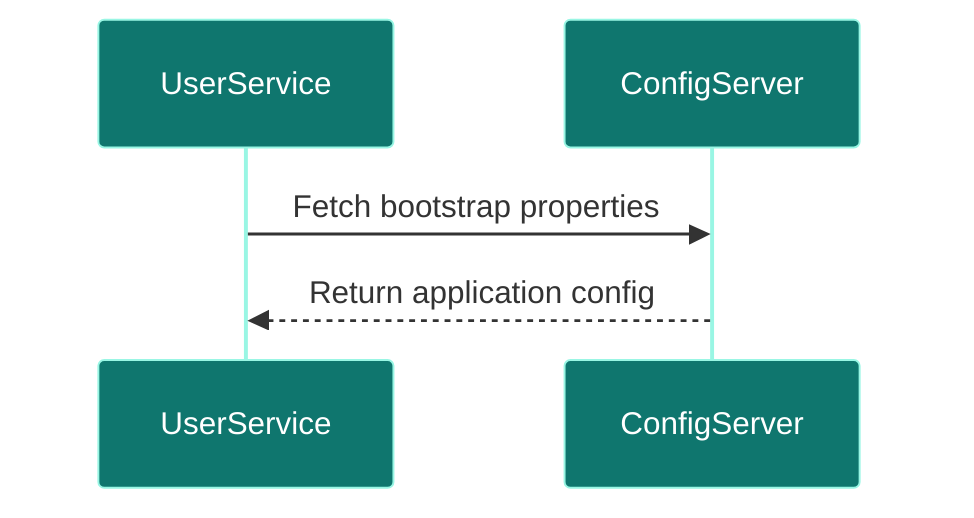

# Config Server

## Overview
- **Purpose:** Centralized, git-backed microservices configuration registry (Proposed).
- **Port:** `8888`
- **Dependencies:** GitHub Repository.
- **Technology Stack:** Spring Cloud Config Server.

## Package Structure (Proposed)
```text
com.jobautomation.configserver
└── ConfigServerApplication.java
```

## APIs
- Exposes property configurations to boot microservices.

## Request Flow


## Dependencies
- **Inbound:** Core services.
- **Outbound:** Git repository.

## Security
- Property decryption via symmetric keys.

## Docker
- Alpine build wrapper.

## Key Takeaways
- Enables dynamic property refresh without redeploying microservices.