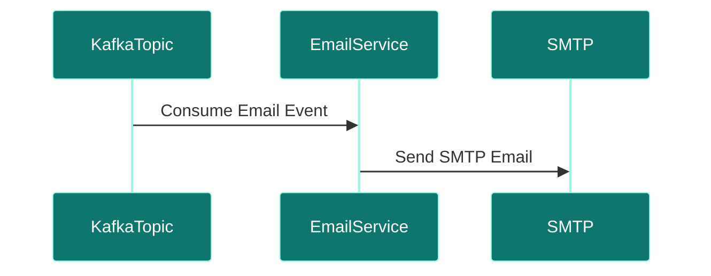
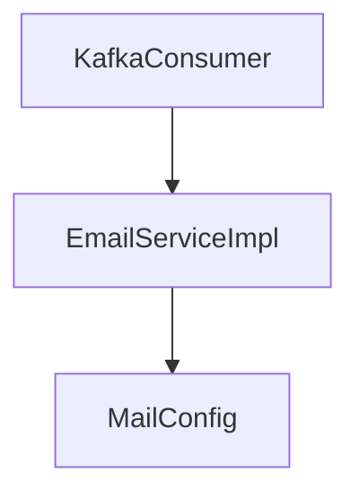

# Email Service

## Overview
- **Purpose:** Dedicated transactional and digest email dispatch system (Proposed).
- **Port:** `8089`
- **Dependencies:** SMTP Mail Server.
- **Technology Stack:** Spring Boot, JavaMailSender.

## Package Structure (Proposed)
```text
com.jobautomation.email
├── service
│   └── EmailServiceImpl.java
└── config
    └── MailConfig.java
```

## APIs
- Uses a Kafka consumer to process email requests asynchronously.

## Request Flow


## Service Architecture Diagram


## Dependencies
- **Inbound:** Kafka Broker.
- **Outbound:** Mail Server.

## Schedulers
- *None.*

## Security
- Secured with SMTP TLS configurations.

## Caching
- No caching.

## Exception Handling
- Retries on transient SMTP connect errors.

## Monitoring
- Logs successful and failed mail deliveries.

## Docker
- standard Alpine runtime.

## Kubernetes
- standard deployment.

## CI/CD
- Deployed via Jenkins/GitHub Actions pipeline stages.

## Key Takeaways
- Decouples email sending from web threads.
- Subscribes to notification topics.