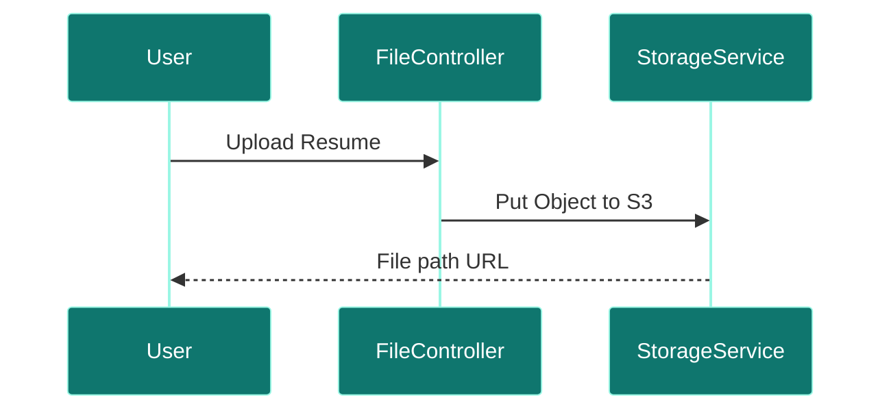
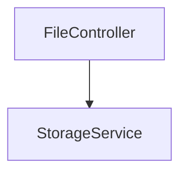

# File Service

## Overview
- **Purpose:** Dedicated binary storage service for resumes and logs (Proposed).
- **Port:** `8090`
- **Dependencies:** AWS S3 / Local storage.
- **Technology Stack:** Spring Boot, AWS SDK.

## Package Structure (Proposed)
```text
com.jobautomation.file
├── controller
│   └── FileController.java
└── service
    └── StorageService.java
```

## APIs
| Endpoint | Method | Description |
| :--- | :--- | :--- |
| `/files/upload` | `POST` | Uploads a binary file. |
| `/files/download/{id}` | `GET` | Fetches a binary file. |

## Request Flow


## Service Architecture Diagram


## Dependencies
- **Inbound:** API Gateway.
- **Outbound:** AWS S3 or shared volumes.

## Schedulers
- *None.*

## Security
- Requires valid user access token.

## Caching
- Proposed Redis cache for frequent files.

## Exception Handling
- Catches file size and storage access exceptions.

## Monitoring
- Storage volume checks.

## Docker
- standard Alpine runtime.

## Kubernetes
- Deployed with volume mounts.

## CI/CD
- Deployed via Jenkins/GitHub Actions pipeline stages.

## Key Takeaways
- Decouples file uploads from user transactions.