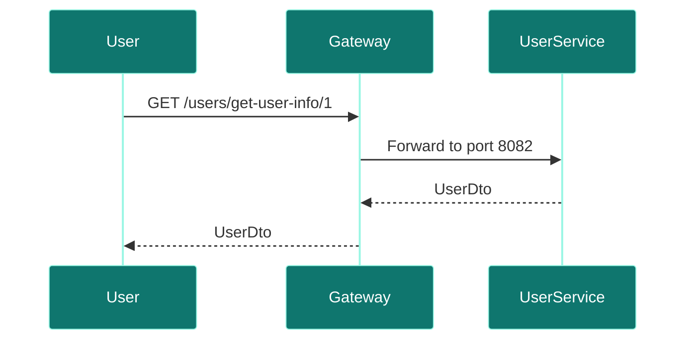
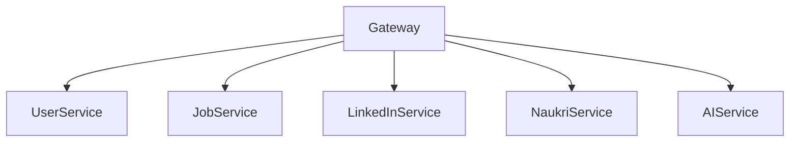

# Gateway Service

## Overview
- **Purpose:** API Gateway entrypoint routing downstream.
- **Port:** `8080`
- **Dependencies:** Core microservices network.
- **Technology Stack:** Spring Cloud Gateway, Netty.

## Package Structure
```text
com.jobautomation.gateway
└── ApiGatewayApplication.java
```

## Routing Rules
| Path Pattern | Forward Destination URL | Downstream Service |
| :--- | :--- | :--- |
| `/users/**` | `http://user-service:8082` | `user-service` |
| `/resume/**` | `http://user-service:8082` | `user-service` |
| `/add-jobs/**` | `http://job-service:8083` | `job-service` |
| `/apply-job/**` | `http://job-service:8083` | `job-service` |
| `/linkedin-jobs/**` | `http://linkedin-service:8084` | `linkedin-service` |
| `/naukri-jobs/**` | `http://naukri-service:8085` | `naukri-service` |
| `/aijobagent/**` | `http://ai-recommendation-service:8086` | `ai-recommendation-service` |

## Request Flow


## Service Architecture Diagram


## Dependencies
- **Inbound:** User Browser.
- **Outbound:** Microservices.

## Schedulers
- *None.*

## Security
- Proposed location for central JWT verification.

## Caching
- Route cache mappings.

## Exception Handling
- Returns HTTP 503 if downstream services are offline.

## Monitoring
- Prometheus gateway connection metrics.

## Docker
- Exposed on port `8080`.

## Kubernetes
- Ingress mappings target gateway service.

## CI/CD
- Deployed via Jenkins/GitHub Actions pipeline stages.

## Key Takeaways
- Acts as the single entry point for routing client requests.