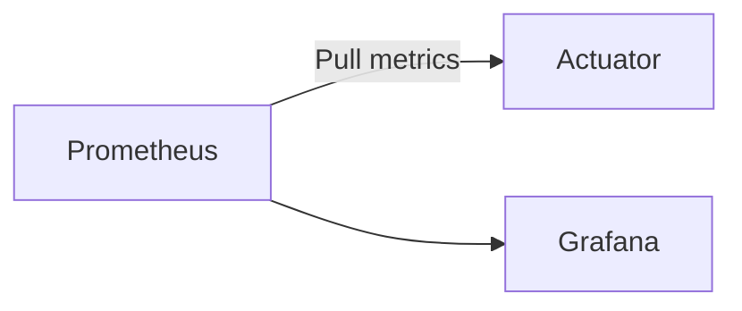

# Monitoring Service

## Overview
- **Purpose:** Aggregates metrics, logs, and trace telemetry across services (Proposed).
- **Port:** `9090` (Prometheus) / `3000` (Grafana)
- **Technology Stack:** Prometheus, Grafana.

## Request Flow

## Key Takeaways
- Visualizes heap dumps, CPU cycles, and database query latency.