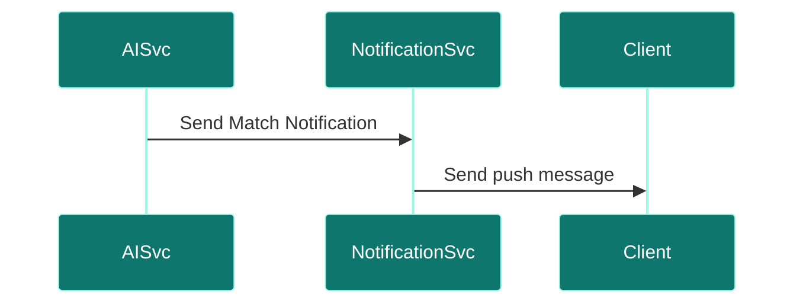
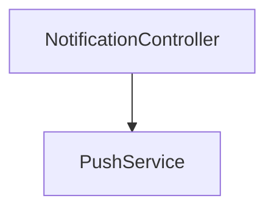

# Notification Service

## Overview
- **Purpose:** Manages candidate alert distribution channels like SMS and Push notifications (Proposed).
- **Port:** `8088`
- **Dependencies:** `notification_db`.
- **Technology Stack:** Spring Boot, Firebase, Twilio.

## Package Structure (Proposed)
```text
com.jobautomation.notification
├── controller
│   └── NotificationController.java
├── service
│   └── PushService.java
└── repository
    └── NotificationRepository.java
```

## APIs
| Endpoint | Method | Description |
| :--- | :--- | :--- |
| `/notifications/send` | `POST` | Publishes notification event. |

## Request Flow


## Service Architecture Diagram


## Dependencies
- **Inbound:** `ai-recommendation-service`.
- **Outbound:** Firebase / Twilio APIs.

## Schedulers
- *None.*

## Security
- Private API authentication keys.

## Caching
- No caching.

## Exception Handling
- SMS/Push delivery failures are logged and retried.

## Monitoring
- Custom metrics logs.

## Docker
- standard Alpine image.

## Kubernetes
- standard configurations.

## CI/CD
- Deployed via Jenkins/GitHub Actions pipeline stages.

## Key Takeaways
- Proposed to inform users about newly matched postings.