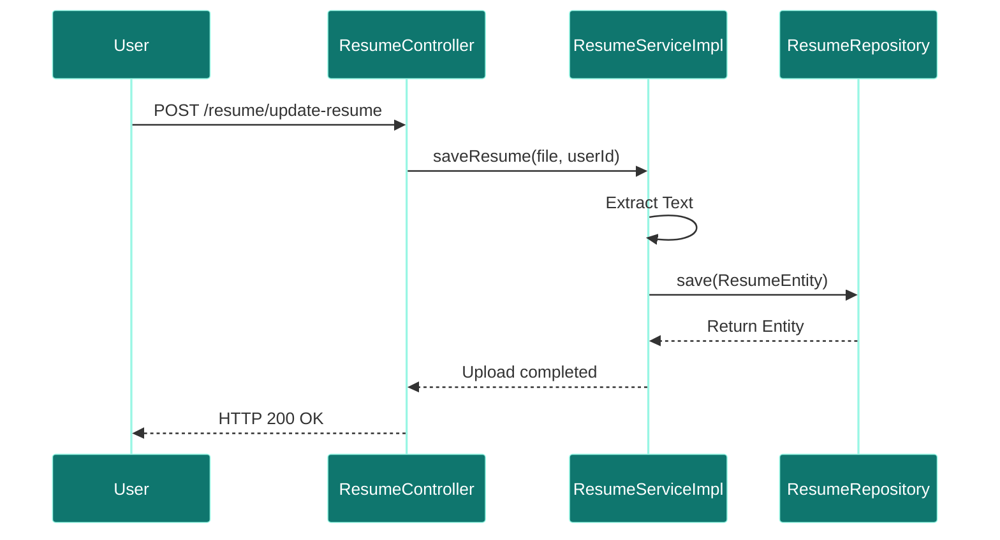
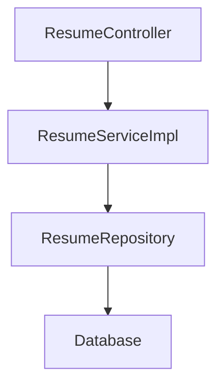

# Resume Service

## Overview
- **Purpose:** Manages resume storage, document formatting, and text extraction pipelines.
- **Port:** `8082` (Logically separate context inside `user-service`).
- **DDD Aggregate:** `UserAggregate`
- **Dependencies:** `user_db` (MySQL)
- **Technology Stack:** Spring Boot, Spring Data JPA, Apache Tika.

## Package Structure
```text
com.jobautomation.user
├── controller
│   └── ResumeController.java
├── entity
│   └── ResumeEntity.java
├── repository
│   └── ResumeRepository.java
└── service
    ├── ResumeService.java
    └── impl
        └── ResumeServiceImpl.java
```

## APIs
| Endpoint | Method | Description |
| :--- | :--- | :--- |
| `/resume/update-resume` | `POST` | Uploads a user resume file. |
| `/resume/users/{userId}/resume` | `GET` | Fetch resume text content. |

## Database Tables
| Table | Purpose | Relationships |
| :--- | :--- | :--- |
| `resumes` | Stores parsed text extracted from resumes. | Many-To-One with `users`. |

### ER Diagram


## Internal Components
- **ResumeController:** Endpoint handler for uploads.
- **ResumeServiceImpl:** Handles multipart parsing and storage.

## Request Flow


## Service Architecture Diagram


## Dependencies
- **Inbound:** `ai-recommendation-service`, API Gateway.
- **Outbound:** `user_db` (MySQL).

## Schedulers
- *None.*

## Security
- Requires user credentials.

## Caching
- No caching.

## Exception Handling
- Handles parsing and validation exceptions.

## Monitoring
- Actuator endpoint.

## Docker
- Uses same container as `user-service`.

## Kubernetes
- Part of user-service deployment block.

## CI/CD
- Deployed via Jenkins/GitHub Actions pipeline stages.

## Key Takeaways
- Separates resume file handling from basic profile properties.
- Extracted text is stored in MySQL for AI matching.