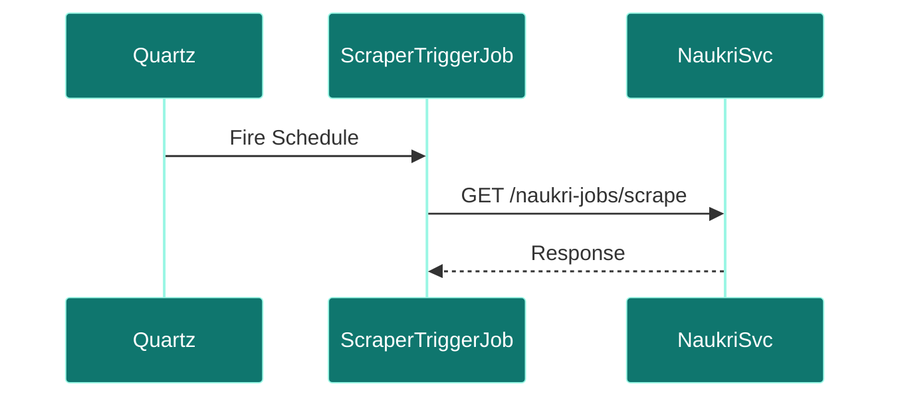
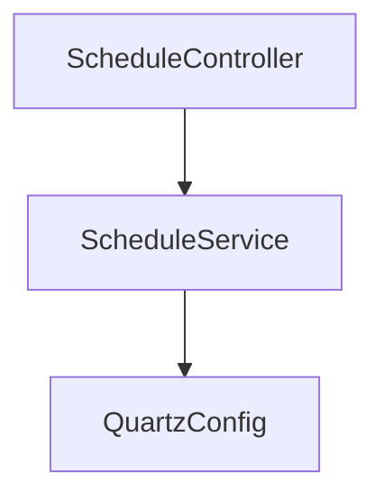

# Scheduler Service

## Overview
- **Purpose:** Manages scheduled triggers for scraping runs and notification dispatches (Proposed).
- **Port:** `8087`
- **Dependencies:** Quartz Scheduler.
- **Technology Stack:** Spring Boot, Spring Quartz.

## Package Structure (Proposed)
```text
com.jobautomation.scheduler
├── controller
│   └── ScheduleController.java
├── config
│   └── QuartzConfig.java
├── job
│   └── ScraperTriggerJob.java
└── service
    └── ScheduleService.java
```

## APIs
| Endpoint | Method | Description |
| :--- | :--- | :--- |
| `/scheduler/create` | `POST` | Creates a new cron scraping schedule. |
| `/scheduler/cancel/{id}` | `POST` | Cancels an active schedule. |

## Database Tables
- Uses Quartz JDBC tables to store schedule metadata.

## Request Flow


## Service Architecture Diagram


## Dependencies
- **Inbound:** Admin Panel.
- **Outbound:** `linkedin-service`, `naukri-service`.

## Schedulers
- Runs custom quartz triggers defined by candidate cron settings.

## Security
- Admin security checks.

## Caching
- No caching.

## Exception Handling
- Handles Quartz exceptions and missed trigger events.

## Monitoring
- Custom alert triggers.

## Docker
- standard Alpine runtime.

## Kubernetes
- Deployed alongside core components.

## CI/CD
- Deployed via Jenkins/GitHub Actions pipeline stages.

## Key Takeaways
- Decouples cron setups from scraper containers.
- Proposed to support daily scraping loops.