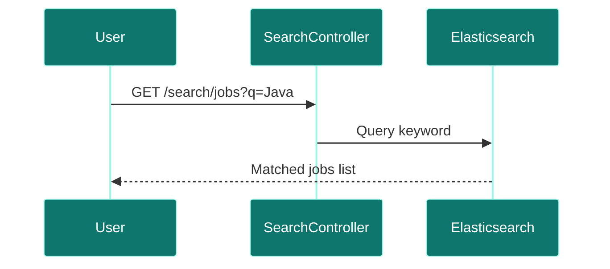
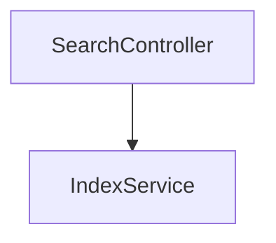

# Search Service

## Overview
- **Purpose:** Full-text indexing and fuzzy search on job descriptions (Proposed).
- **Port:** `8091`
- **Dependencies:** Elasticsearch.
- **Technology Stack:** Spring Boot, Spring Data Elasticsearch.

## Package Structure (Proposed)
```text
com.jobautomation.search
├── controller
│   └── SearchController.java
└── service
    └── IndexService.java
```

## APIs
| Endpoint | Method | Description |
| :--- | :--- | :--- |
| `/search/jobs` | `GET` | Queries index for keyword matches. |

## Request Flow


## Service Architecture Diagram


## Dependencies
- **Inbound:** API Gateway.
- **Outbound:** Elasticsearch.

## Schedulers
- Proposed nightly synchronization schedule.

## Security
- Basic authentication keys.

## Caching
- Elasticsearch native queries.

## Exception Handling
- Catches query parsing exceptions.

## Monitoring
- Elasticsearch health checks.

## Docker
- standard Alpine runtime.

## Kubernetes
- standard deployments.

## CI/CD
- Deployed via Jenkins/GitHub Actions pipeline stages.

## Key Takeaways
- Designed to index thousands of job records for search query speeds.