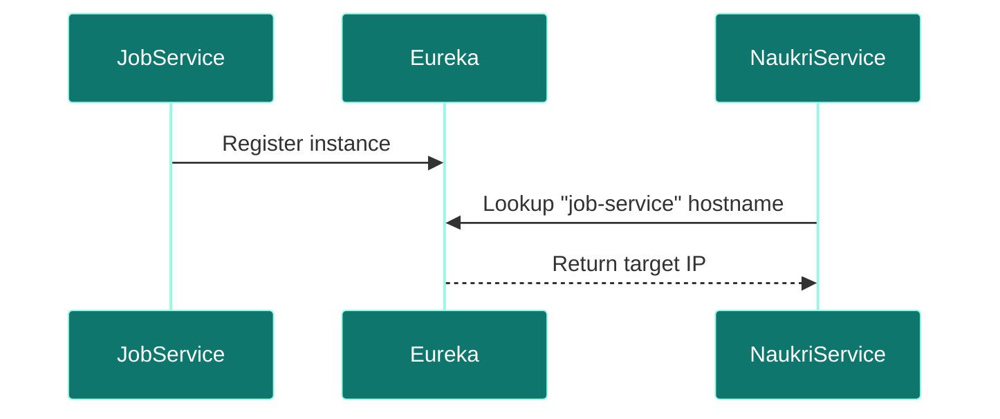

# Service Registry

## Overview
- **Purpose:** Netflix Eureka registry for service registration and discovery (Proposed).
- **Port:** `8761`
- **Technology Stack:** Spring Cloud Netflix Eureka Server.

## Package Structure (Proposed)
```text
com.jobautomation.registry
└── ServiceRegistryApplication.java
```

## Request Flow


## Key Takeaways
- Eliminates hardcoded hostname settings inside scraper properties.